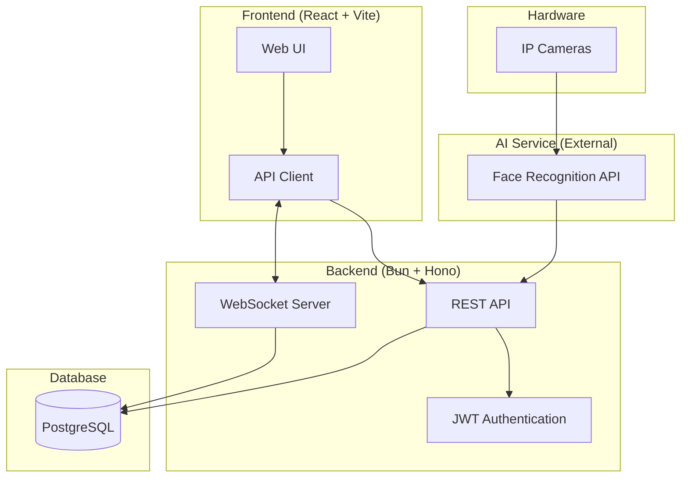
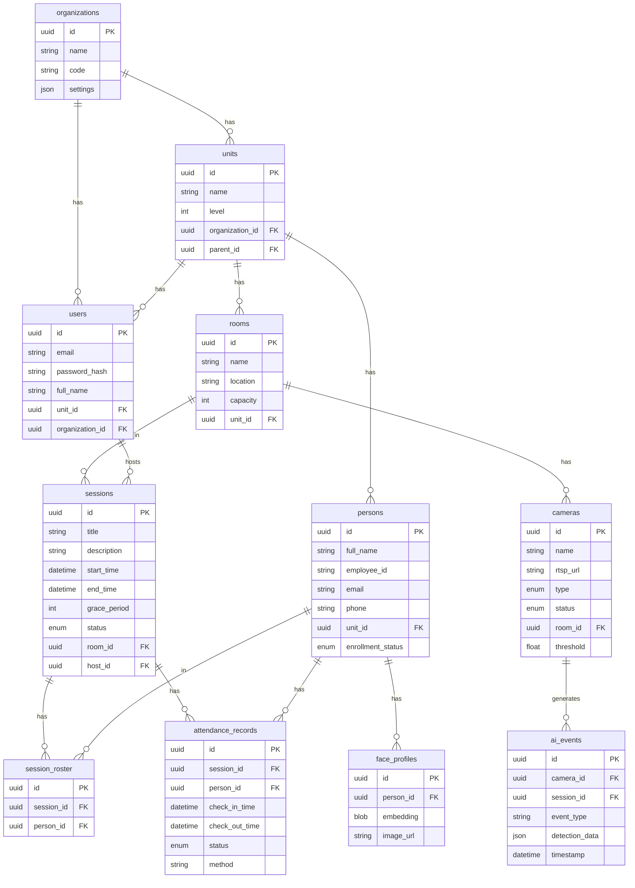
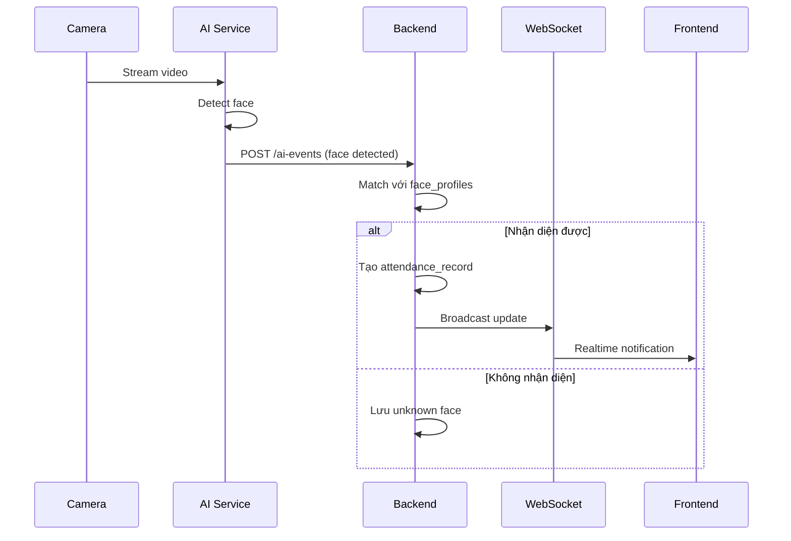
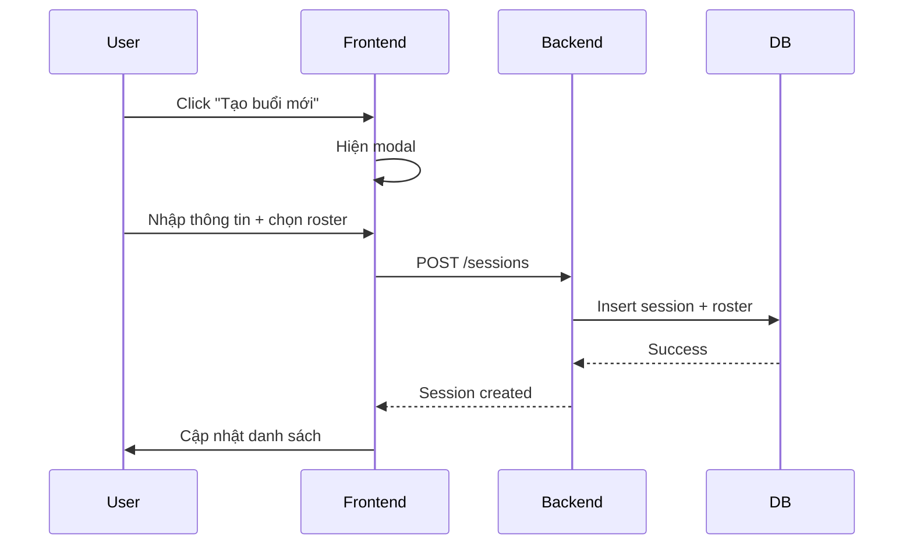

# Smart App - Mô tả Thiết kế Hệ thống

## 1. Tổng quan
## 2. Kiến trúc hệ thống



---

## 3. Tech Stack

| Layer | Technology |
|-------|------------|
| **Frontend** | React 18, TypeScript, Vite, React Router |
| **Backend** | Bun runtime, Hono framework, TypeScript |
| **Database** | PostgreSQL + Drizzle ORM |
| **Auth** | JWT (JSON Web Tokens) |
| **Realtime** | WebSocket (Bun native) |
| **AI** | External Face Recognition API |

---

## 4. Database Schema



---

## 5. API Endpoints

### Authentication
| Method | Endpoint | Mô tả |
|--------|----------|-------|
| POST | `/api/auth/login` | Đăng nhập |
| GET | `/api/auth/me` | Lấy thông tin user |
| POST | `/api/auth/change-password` | Đổi mật khẩu |

### Sessions (Buổi điểm danh)
| Method | Endpoint | Mô tả |
|--------|----------|-------|
| GET | `/api/sessions` | Danh sách buổi |
| POST | `/api/sessions` | Tạo buổi mới |
| GET | `/api/sessions/:id` | Chi tiết buổi |
| POST | `/api/sessions/:id/start` | Bắt đầu buổi |
| POST | `/api/sessions/:id/end` | Kết thúc buổi |
| POST | `/api/sessions/:id/lock` | Khóa buổi |

### Attendance (Điểm danh)
| Method | Endpoint | Mô tả |
|--------|----------|-------|
| GET | `/api/attendance/session/:id` | Điểm danh theo buổi |
| POST | `/api/attendance/checkin` | Điểm danh thủ công |

### Persons (Nhân sự)
| Method | Endpoint | Mô tả |
|--------|----------|-------|
| GET | `/api/persons` | Danh sách nhân sự |
| POST | `/api/persons` | Thêm nhân sự |
| PUT | `/api/persons/:id` | Cập nhật |
| DELETE | `/api/persons/:id` | Xóa |

### Rooms & Cameras
| Method | Endpoint | Mô tả |
|--------|----------|-------|
| GET/POST | `/api/rooms` | CRUD phòng |
| GET/POST | `/api/cameras` | CRUD camera |
| POST | `/api/cameras/:id/test` | Test kết nối |

### Reports
| Method | Endpoint | Mô tả |
|--------|----------|-------|
| GET | `/api/reports/dashboard` | Dashboard stats |
| GET | `/api/reports/session/:id` | Báo cáo buổi |
| GET | `/api/reports/export/session/:id` | Export Excel |

---

## 6. Frontend Structure

```
frontend/
├── src/
│   ├── components/
│   │   ├── Layout.tsx          # App layout với sidebar
│   │   ├── Modal.tsx           # Reusable modal
│   │   ├── ConfirmDialog.tsx   # Confirmation dialogs
│   │   └── Create*Modal.tsx    # CRUD modals
│   ├── pages/
│   │   ├── Login.tsx           # Đăng nhập
│   │   ├── Dashboard.tsx       # Tổng quan
│   │   ├── Sessions.tsx        # Quản lý buổi
│   │   ├── SessionDetail.tsx   # Chi tiết buổi
│   │   ├── Persons.tsx         # Quản lý nhân sự
│   │   ├── Rooms.tsx           # Quản lý phòng
│   │   ├── Cameras.tsx         # Quản lý camera
│   │   ├── Reports.tsx         # Báo cáo
│   │   ├── Settings.tsx        # Cài đặt
│   │   └── UnknownFaces.tsx    # Khuôn mặt lạ
│   ├── hooks/
│   │   ├── useAuth.tsx         # Authentication context
│   │   └── useTheme.tsx        # Theme context
│   ├── lib/
│   │   └── api.ts              # API client
│   └── styles/
│       └── index.css           # Design system
```

---

## 7. Luồng hoạt động

### 7.1 Luồng điểm danh tự động


### 7.2 Luồng tạo buổi điểm danh


---

## 8. Bảo mật

- **Authentication**: JWT tokens với expiry time
- **Authorization**: Role-based (super_admin, admin, user)
- **Password**: Hashed với bcrypt
- **API**: CORS configured, rate limiting
- **Data**: Multi-tenant isolation by organization_id

---

## 9. Scalability

- **Horizontal**: Multiple backend instances behind load balancer
- **Database**: Connection pooling, read replicas
- **AI**: Separate microservice, queue-based processing
- **Cache**: Redis for session data (future)
